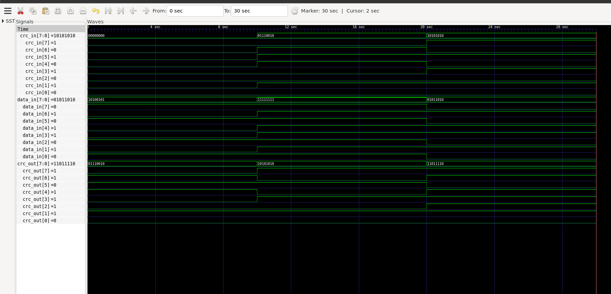
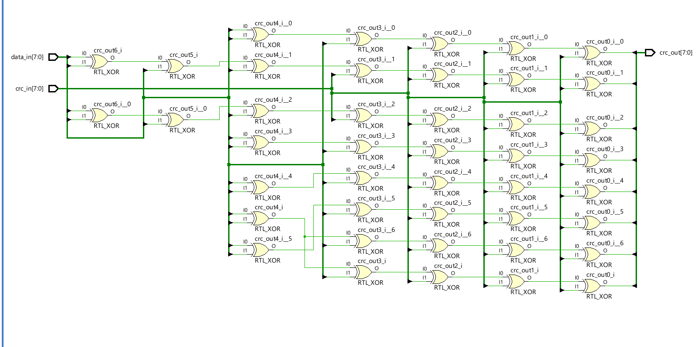
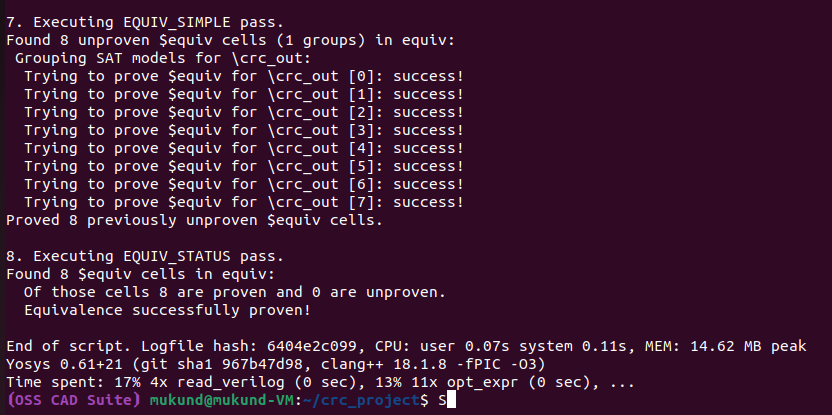
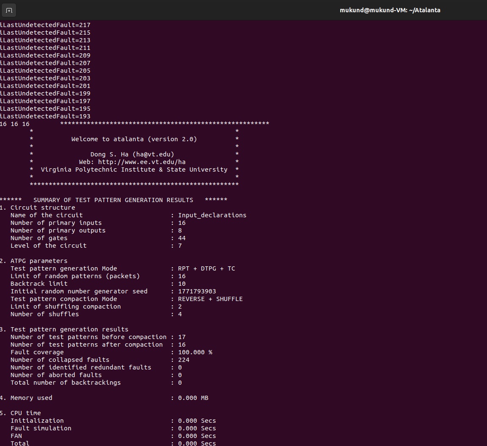
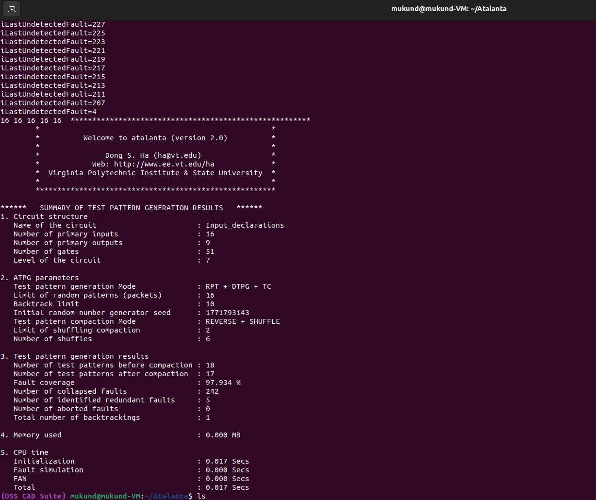
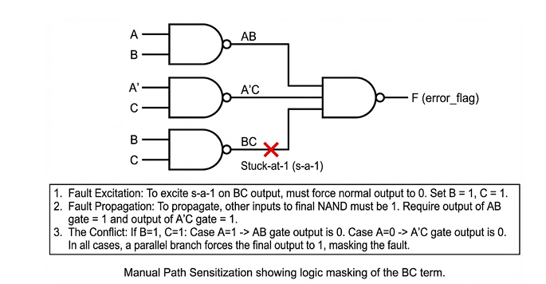

# ATPG and Fault Coverage Analysis of a CRC-8 Integrity Module

## Project Overview
This repository contains the complete workflow and toolchain for the design, synthesis, formal verification, and Automatic Test Pattern Generation (ATPG) of an 8-bit Cyclic Redundancy Check (CRC) module. 

The primary objective of this project is to implement a purely combinational, parallel CRC-8 generator and rigorously evaluate its structural testability under the Single Stuck-At Fault (SSF) model. By mathematically unrolling 8 clock cycles of Linear Feedback Shift Register (LFSR) shifts into a single combinational XOR-tree, the hardware calculates the remainder instantaneously. 

A core focus of this project is the theoretical analysis of structural fault testability. After establishing that the baseline architecture achieves 100% fault coverage, we intentionally injected hardware redundancy—modeled on the Consensus Theorem—into the gate-level netlist. This phase of the project physically demonstrates Boolean logic masking and the structural causes of fundamentally untestable (redundant) faults.

**Course:** ECS324 VLSI Testing & Verification  
**Faculty Mentor:** Dr. Lakshmi N S

---

## Theoretical Background

### The Single Stuck-At Fault (SSF) Model
The SSF model assumes that a manufacturing defect causes a single node in the circuit to be permanently tied to Logic 0 (Stuck-at-0) or Logic 1 (Stuck-at-1). ATPG tools utilize algorithms (such as the D-Algorithm or FAN) to find an input vector that both sensitizes the fault and propagates the error to an observable primary output.

### Logic Masking and Intentional Redundancy
A fault is classified as "redundant" if no possible input vector can propagate its effect to a primary output. This occurs when boolean logic creates a masking effect. To practically demonstrate this phenomenon, we augmented the pure CRC-8 design with an auxiliary `error_flag` logic block based on the Consensus Theorem:

`F = AB + A'C + BC`

In this equation, the `BC` term is mathematically redundant. However, in physical VLSI design, the `BC` gate is frequently included as a Static-1 Hazard Cover to prevent voltage glitches during state transitions. Because the `BC` term is functionally dominated by the parallel `AB` and `A'C` branches, stuck-at faults occurring specifically on the `BC` logic path cannot be observed at the primary output, rendering them structurally untestable.

---

## Toolchain and Methodology
The verification and testing methodology utilizes an open-source VLSI toolchain, executed in a Linux environment:
1. **Icarus Verilog & GTKWave:** RTL behavioral design and functional simulation.
2. **Yosys:** Logic synthesis to gate-level netlist and Formal Equivalence Checking (EQY).
3. **Vivado:** RTL Schematic generation for visualization.
4. **Python:** Custom automation to expand XOR logic into ISCAS89 `.bench` pure NAND-gate formats to bypass legacy parser "floating net" limitations.
5. **Atalanta:** ATPG test pattern generation and fault simulation using the FAN Algorithm.

---

## Phase 1: RTL Design and Simulation
The CRC-8 module processes an 8-bit input data block (`data_in`) and the previous 8-bit CRC state (`crc_in`) to generate the new remainder (`crc_out`). The design was verified using Icarus Verilog and GTKWave. The resulting waveform confirms the combinational propagation of the signals instantaneously without clock synchronization.

---

## Phase 2 & 3: Logic Synthesis and Formal Equivalence
The behavioral RTL was synthesized down to gate-level logic. The RTL schematic confirms that the behavioral assign statements were successfully mapped to a flattened XOR-gate topology. 

To verify the integrity of the synthesis process, Yosys EQY was utilized to mathematically prove that the gate-level netlist perfectly matches the behavioral Verilog RTL.

---

## Phase 4 & 5: Fault Simulation and ATPG Results

### 1. Baseline Architecture (100% Testability)
The pure CRC-8 combinational logic was tested against the FAN algorithm. Because the XOR-tree lacks deeply nested reconvergent fanouts that mask logic levels, observability and controllability are inherently maximized.
* **Total Collapsed Faults:** 224
* **Test Patterns Generated:** 16
* **Redundant Faults:** 0
* **Fault Coverage:** 100.000%

### 2. Modified Architecture (Hardware Redundancy Injected)
To evaluate the impact of redundancy, the `error_flag` logic block was appended to the netlist. Atalanta explicitly identified 5 redundant faults, dropping the overall coverage to 97.934%. These faults correspond exactly to the `BC` hazard cover logic path we injected. 

### Manual Verification of Redundant Faults (Mathematical Proof)
To mathematically prove the results output by Atalanta's `.ufaults` file, we manually traced the D-Algorithm for the first identified redundant fault: `N204 /1` (Node 204 Stuck-at-1). 

As demonstrated in the hand-trace, forcing the necessary fault excitation conditions (`B=1, C=1`) inevitably forces one of the parallel branches to dominate the final NAND gate. Because excitation and propagation conditions fundamentally conflict, the fault effect cannot reach the primary output, confirming the tool's finding that the faults are physically unobservable.

---

## Repository Structure

**RTL, Synthesis, and Verification:**
* `crc8.v` - Behavioral RTL Verilog code for the parallel CRC-8.
* `tb.v` - Testbench for verifying combinational functionality.
* `synth.ys` - Yosys synthesis script.
* `crc8_netlist.v` - Synthesized gate-level netlist.
* `equiv.ys` - Yosys Formal Equivalence Checking script.

**ATPG and Fault Analysis:**
* `gen.py` & `gen_bench.py` - Python scripts to generate NAND-based ISCAS89 benchmark files.
* `c8bitnormal.bench` - ISCAS89 benchmark file for the baseline CRC-8 architecture.
* `c8bitnormal.test` & `c8bitnormal.vec` - ATPG test vectors for the baseline architecture.
* `c8bit.bench` - ISCAS89 benchmark file with the injected Consensus Theorem redundancy.
* `c8bittest.test` & `c8bit.vec` - ATPG test vectors for the redundant architecture.
* `c8bit.ufaults` - Atalanta output report listing the identified redundant (untestable) faults.

**Documentation and Assets:**
* `report_crc8 (1).pdf` - Full project report containing theoretical analysis, mathematical proofs, and tool logs.
* `images/` - Directory containing simulation waveforms, schematics, and terminal outputs.
